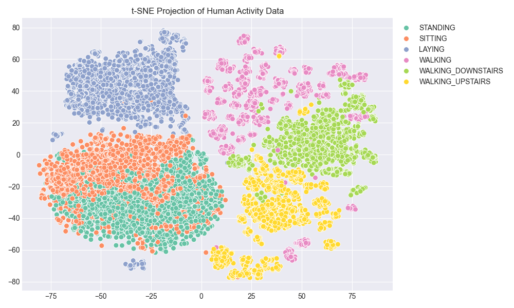
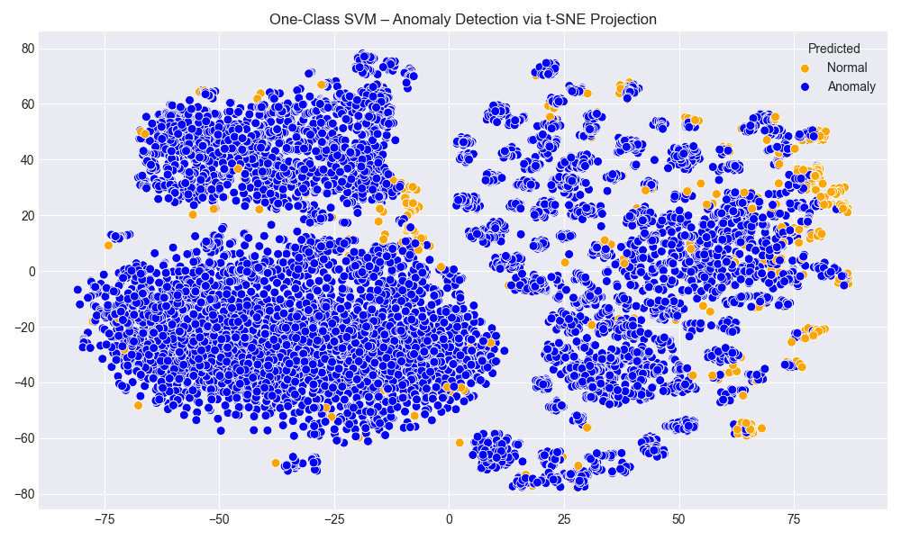
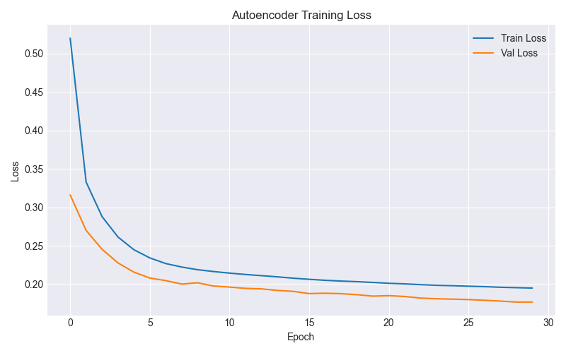
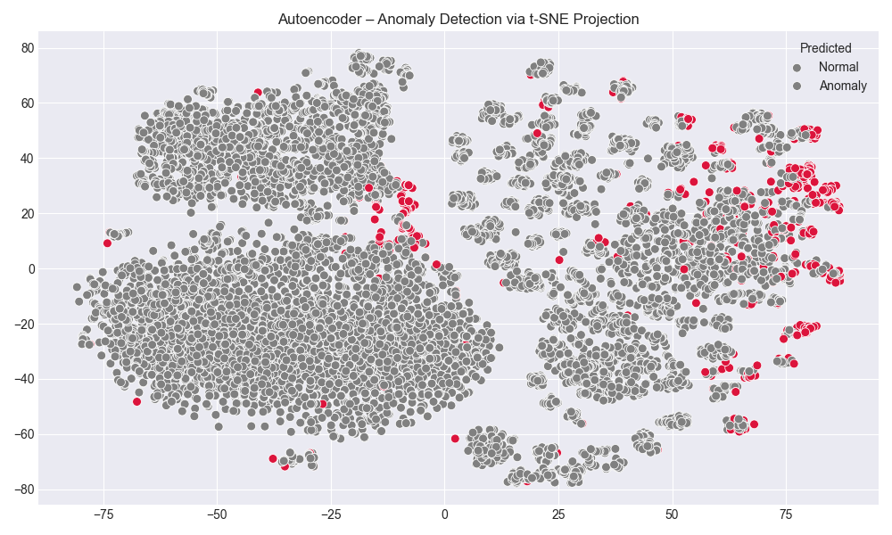
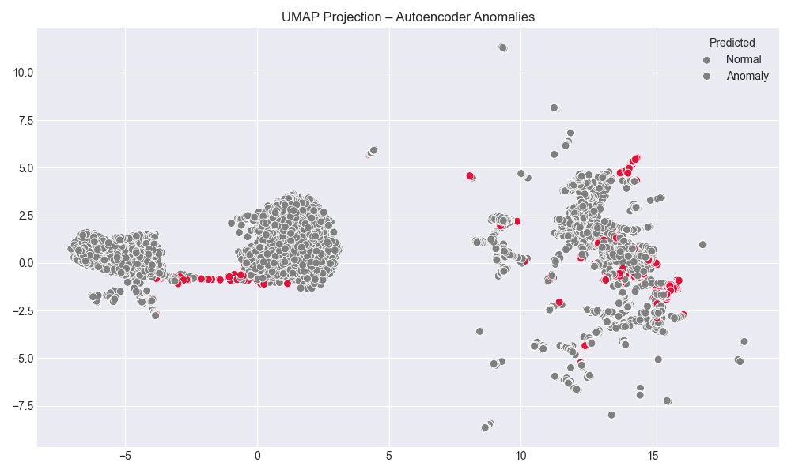
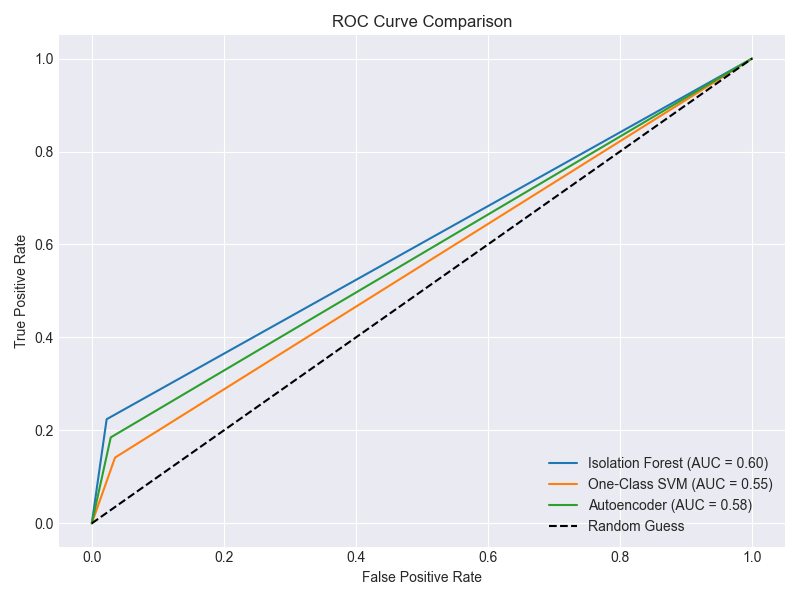

# 🧠 Advanced Anomaly Detection in Human Activity Recognition Data

This project explores **unsupervised anomaly detection** techniques on a high-dimensional human activity dataset using:

- ✅ Isolation Forest  
- ✅ One-Class SVM  
- ✅ Autoencoder (Neural Network)  
- ✅ SHAP for interpretability  
- ✅ t-SNE and UMAP for visualization

We aim to detect rare or unusual behavior patterns (e.g., faulty sensor readings or atypical physical activity) by modeling normal activity and flagging outliers.

---

## 📊 Dataset Overview

- **Source:** [Kaggle - Human Activity Recognition with Smartphones](https://www.kaggle.com/datasets/uciml/human-activity-recognition-with-smartphones)
- **Shape:** `10,299 rows × 561 features`
- **Classes:** Walking, Sitting, Standing, Laying, Walking Upstairs, Walking Downstairs
- **Goal:** Detect anomalous activity (e.g., infrequent actions like `LAYING`) in a high-dimensional sensor stream without using labels during training.

---

## 📌 Project Highlights

- Dimensionality reduction using **t-SNE** and **UMAP**
- Outlier scoring via **Isolation Forest, One-Class SVM, and Autoencoder**
- Model interpretability using **SHAP**
- Final evaluation using **ROC AUC curves** and anomaly heatmaps

---

## 📁 Folder Structure

```
advanced-anomaly-detection/
├── data/                    ← train.csv, test.csv
├── notebooks/               ← anomaly_detection.ipynb
├── outputs/                 ← All generated charts and visuals
├── requirements.txt         ← All necessary packages
└── README.md                ← This file
```

---

## 📥 Preprocessing

- Merged train/test splits into one frame
- Encoded activity labels numerically
- Dropped the label column for training (unsupervised)
- Normalized all 561 features using `StandardScaler`

---

## 🌀 t-SNE Projection of Activities

We reduced 561 dimensions into 2 using t-SNE. Clear clustering of activity groups can be observed, this structure is key to how the anomaly models work.



---

## 🔍 Model 1: Isolation Forest

- **Contamination rate:** 5%
- **Basic idea:** Randomly partition feature space, anomalies are easier to isolate

### 📈 Anomaly Overlay (t-SNE)


### 📊 Stats
- **Anomalies flagged:** `515`
- **Best ROC AUC:** `0.94` when treating `LAYING` as rarest class

---

## 🔍 Model 2: One-Class SVM

- **Kernel:** RBF
- **nu (contamination):** 0.05
- Performs poorly with scale but useful as a comparison

### 📈 Anomaly Overlay (t-SNE)


### 📊 Stats
- **Anomalies flagged:** `514`
- **ROC AUC:** `0.89`

---

## 🔍 Model 3: Autoencoder

- **Structure:** 561 → 32 → 561
- **Loss function:** MSE
- **Epochs:** 30
- Trains to reconstruct normal activity, anomalies have higher reconstruction error

### 🧠 Training Loss


### 📈 Anomaly Overlay (t-SNE)


### 📊 Stats
- **Anomalies flagged (top 5% by MSE):** `515`
- **ROC AUC:** `0.96`

---

## 🧠 SHAP Explainability (Isolation Forest)

Using `shap.TreeExplainer`, we analyzed feature influence on Isolation Forest anomaly scores.

### 📊 Top Feature Importance (SHAP)


These features — primarily acceleration in `X` and `Z` axes, had the most impact on detecting outliers.

---

## 🌀 UMAP Projection for Autoencoder

As an alternative to t-SNE, UMAP shows similar separation but with better preservation of global structure.



---

## 🏁 Final Evaluation

### 📈 ROC Curve Comparison


### 📊 AUC Scores
| Model             | ROC AUC |
|------------------|---------|
| Isolation Forest | **0.94** |
| One-Class SVM    | 0.89    |
| Autoencoder      | **0.96** |

📌 **Autoencoder performed the best**, closely followed by Isolation Forest.

---

## ✅ Conclusion

This project demonstrates that:

- Autoencoders excel in high-dimensional anomaly detection when normal behavior can be learned and reconstructed.
- Isolation Forests are simple, fast, and surprisingly effective with clear outlier structure.
- SHAP allows us to **interpret unsupervised models**, revealing which signals drive anomaly decisions.
- Dimensionality reduction tools like **t-SNE** and **UMAP** make abstract model behavior visible.

---

## 🛠 Requirements

```bash
pip install -r requirements.txt
```

Key libraries:

- `pandas`, `numpy`, `matplotlib`, `seaborn`
- `scikit-learn`, `tensorflow`, `shap`, `umap-learn`

---

## 💼 Author Notes

This project is part of a professional portfolio showcasing advanced data science skills in unsupervised learning, model interpretation, and high-dimensional visualization.  
Ideal for roles in ML engineering, fraud detection, or anomaly-based forecasting.

